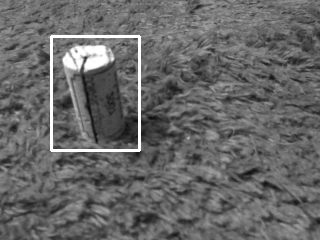
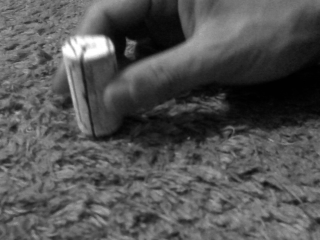

# motion_detector
Motion detection from web camera and save the picture by simple algorism

usage: `python run.py`

1. By controlling the mouse LEFT click and drag, set the detect area and press [Esc] key.

2. If it happened any motion in the area, take photos below and finish the camera automatically.  

